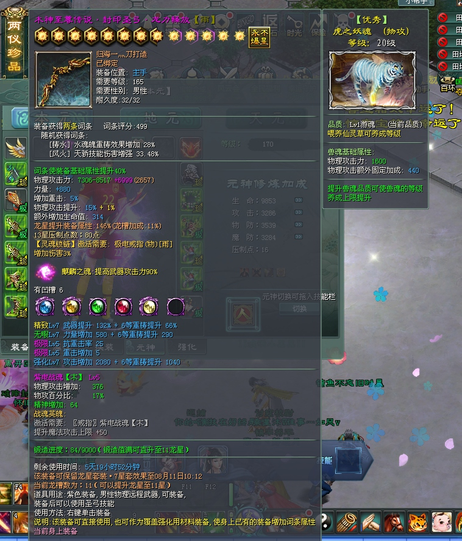

# 细节
## GUI细节
- close问题，dialog里面有一种style是自带关闭按钮的，但是一开始没找到设置位置的问题，发现在dialog一栏最后加一个`close = "100,200"`即可修改位置，目前不知道是否能修改图片（初步估计是不行0 ），如果需要其他需求，最好还是代码里面改，还能加代码量，美滋滋。
- style和align问题，都有不同的封装，因为不能初始创建gui，所以一般都是复制其他的界面xml文件，所以这部分欠缺，需要注意。
- `OnGuiEvent`的封装，比征途1精彩多了，各种效果。
- `Table`是一个大块，可以通过colwidth和colheight来计算这个格子总共有多少个。`{38,38}`是一个格子的大小。一开始在包裹里面试验，发现改了没什么反应，需要重启才行，看来只读取一遍，应该是存了static。至于副包裹，是在代码中动态修改行列的。**还有一点要注意的，如果根据colwidth和基本格子大小，应该需要显示5行，你设置只显示4行，如果实际上空间允许，还是会显示的，除非被裁剪了。只不过额外显示出来的那一行不能放东西。**这里又出现了最大魔攻代表了显示列数了，起乱七八糟的字段，让我想起了迁个性界面的时候。
- **因为现在使用的编译版本直接是`release`所以，先前出现的一个特点，在当前版本下，可能会经常出现，就是变量没有初始化，比如`CGuiListBox`的`Col`的`Width`就没有初始化，造成了在热力值排行榜需求的时候出现问题，未定义的不显示国家。**

## GUI实例
### ToolTips
**这个GUI控件在免费版没有，或者说我印象中我好像没有接到类似的控件，姬佬的文档中好像也没有看到，那应该就是没有。**
- 这是一个悬浮控件，是依附在其他的控件上的，`button`,`table`等，在悬浮中可以显示文字，图片，线段（？），空格，`tab`（？）。

大多数时候都是文字和图片的结合，加以空格和横线过渡。调用渲染的部分在`GuiManager.cpp`的`Render`函数里面，（查看的时候发现`m_Dialogs`还是以`vector`形式存储的，不过没有`GetGameGuiManager()->FindDialogEx()`了，直接就是单例）不过注意，这个东西的逻辑非常复杂，理论上能显示9块悬浮，而且后面的悬浮是否显示要看前面某一块悬浮是否有显示，比如`tooltips3`需要`tooltips2`显示，不然直接获取`tooltips3`并在里面添加元素，也是不会渲染的。然后`tooltips`调用自己的渲染`Render`，再去渲染自己的元素，边框等。
- **本次最关键的一个接口是强制渲染，然后调整位置，`RenderToolTipsList()`，放在判断这群`tooltips`是否渲染前面即可。**