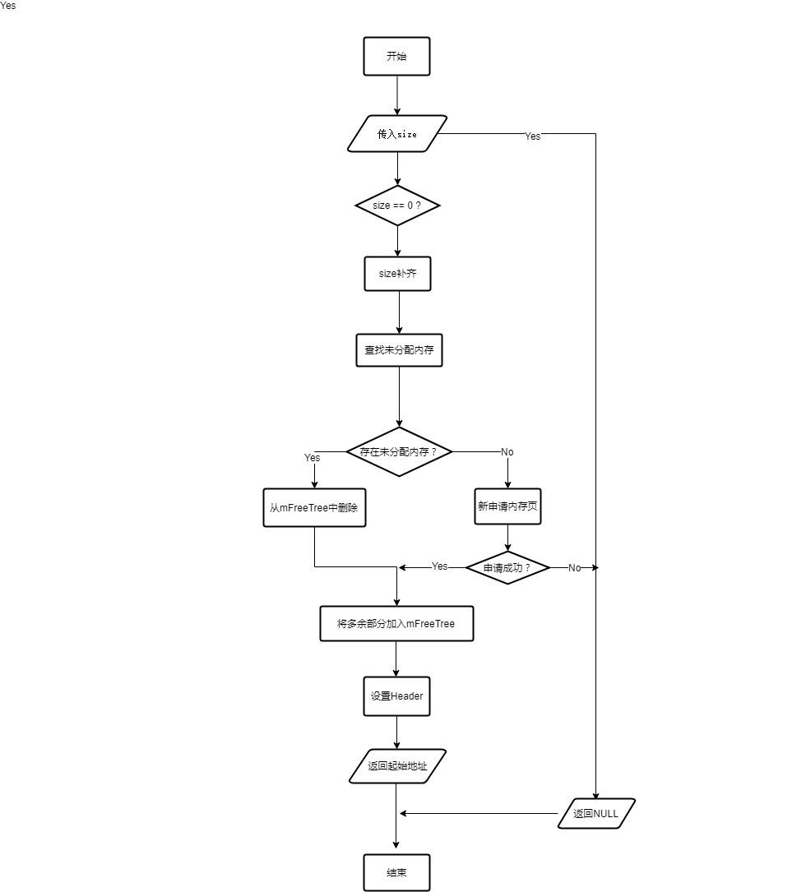
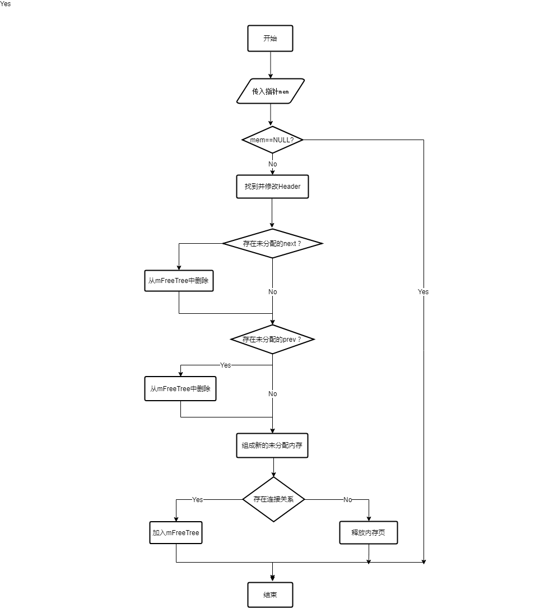

# 客户端内存池
> 这套内存分配，来自06年架构师许朝，客户端使用多年。（也可能后面有陆续修改）
> 客户端重载了new和delete运算符，以下涉及到相关的代码，用的都是重载后的。
## alloc/free流程图

 

1. size对齐16B
2. 待分配内存块后面连着备用内存块
3. 内存池包含多个内存页。每个内存页里面有已分配内存块和未分配内存块。
4. 这整个整体是一个纵向和横向都有连接的部分。内存页之间是nextPage/prevPage,内存块之间是nextQueue/prevQueue。
### alloc部分
1. 每次分配（ alloc）的时候，在mFreeTree中查找是否有>= size的最小未分配内存。mFreeTree是一个内存块的std::set结构，记录的待分配的内存。
    - 如果mFreeTree中存在足够大的内存，则将其从mFreeTree中删除。如果mFreeTree中存在大小相等的备用内存（之前那个足够大的内存），则将该备用内存作为下次alloc时的待分配内存。（待分配内存和备用内存的内存头结构一样FreeHeader）大小相同的内存组成prevQueue/nextQueeu指针链式结构。
    - 如果mFreeTree中不存在足够的未分配内存，则重新申请一个内存页(allocMemPage)。内存页由一个内存页头和待分配内存组成。且申请的内存页与之前的内存页建立prevPage/nextPage链式结构。（与上面的不太一样）
2. 现在得到了内存块，内存块的前size + sizeof(Header)作为这次分配部分，如果此次分配之后剩下的空间 >= size ，多余的部分加入mFreeTree(checkUnusedAlloc)，可以下次使用，分配部分和多余部分（如果有）建立prev/next链式结构。此时如果有在mFreeTree中已经有与此次加入的新的未分配内存同大小的内存块，则将新加入的内存块作为备用内存，放末尾。
3. 最后，将本次分配的内存的header状态置为已分配，返回header最后一位地址。
### free部分
1. 对于free，根据释放地址计算header，置为未分配。
2. 如果mem的next/prev未分配，从mFreeTree中删除，与next合并为一个新的未使用内存。
3. 如果的带的未分配内存不存在prev/next关系，说明其属于的内存页不在使用，需要释放；否则加入mFreeTree。
