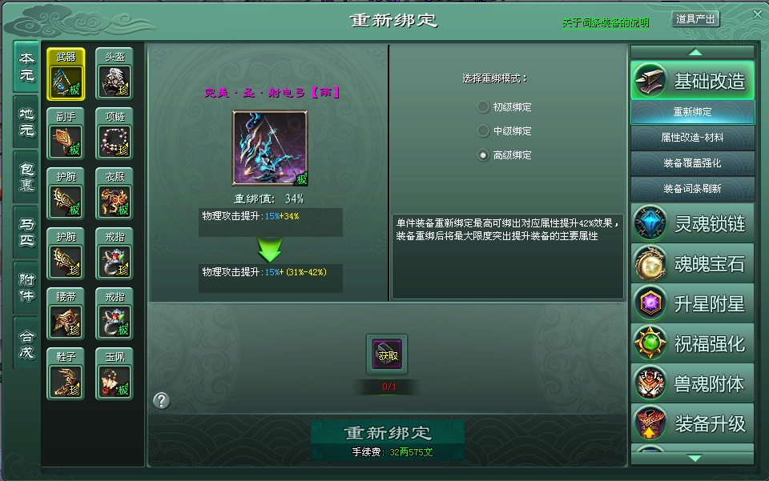

[TOC]
# 战神套
## 前言
该需求涉及范围很广，包括前面学到的**lua脚本的注册，技能，打表，对装备强化界面的理解熟悉，升星绘制和升星突破，委托事件，消息派发新方法，SimpleTab使用**等。**进一步加深了对继承，继承中函数的调用，信息管理，设计模式的理解**。
## 功能描述
- 9.20节点的重要功能之一，是赛季套装之一，每个赛季结束后会增加一套。
- 使用了类似装备的概念，分为四个部件，可以对部件升星，增加属性，功能入口为强化界面的附件的战神套道具图标（假道具图标）。
## 涉及代码段
`GodofWarDlg.cpp`,`GodofWarDataMgr.cpp`,`GodofWarSuitConfig.cpp`,`ParseProperty8UserCmd.cpp`,`MITextBoxCallBack.cpp`,`OpenLiBaoFunctions.cpp`,`GuiEquipRebuildDlg.cpp`等。
## 界面细节

- 如上图，该界面元素很多，逻辑很多，右侧每个大的栏目都是一个新类，需要继承`EquipRebuildBase`，再在里面对基类的`virtual`函数进行重写。
- 粗看，早期的界面通常是在`gui.xml`里面添加一个新的`SimpleTab`控件，在下面的绑定`lua`函数里面进行初始化往这些`Tab`里面添加对应的控件如`Button,Static,Image`等。后来的`Tab`都是一开始就写好里面有哪些控件id。**这也导致了这个gui文件很大，有5000+行，600+KB大小**。
- 附件部分的假道具，注意，是`Table`的控件，需要配合代码仔细查看。点击从点击附件按钮，到左边出现道具，点击道具出现右侧栏目，再到中间`SimpleTab`绘制这一栏的内容，要经过很多步骤。
## 代码细节
1. 这个单子客户端大概功能完成花了2天。遇到了一些的问题。
2. 基类中重写的函数较多，记得不要漏掉。
3. **有一个对属性进行的操作，使用另一个函数`AppendParagraph()`**进行替代，先前的神将卡和这里的战神套属性都可以进一步的化简，将很多的MLText缩减到2个即可。先前我的代码确实有点蠢。那么到现在，已经有3，4中方法来填写对应的属性，如`Static`直接填写，`stream`输入，`MLText`的填写，最后灵活性最大的是`MLText`控件。
4. 附件左边一排道具，是一个个`Table`,会根据条件判断是否往里面加，如果条件满足，会往里面添加对应的`panelID`,在函数`fillEquip`中会遍历这个结构，去`new CRoleItem()`。然后点击事件集中在`RoleItem.cpp`的`ItemTableEvent()`中，然后物品格子种类对应有一万个，一个个`switch-case`，再从这个`Table`控件转回`GuiEquipRebuildDlg`的处理函数，最后来到另一个控件`QQPanel`，里面有一块专门对几个模块的`QQPanel`处理，一系列切换，从`QQPanel`回到`GuiEquipRebuildDlg`的`switchTab`函数，才是添加附件界面右侧的哪几个`tab`栏目，对应的图片设置等。
5. 点了左边这个装备展示用的`Table`，右边这个`Tab`显示什么东西，在`GuiEquipRebuildDlg::onClickSoource2`函数里面的`updateTab`里面进行调用，然后进行状态的设置，如花神卡，会检查你点击的这个装备的类型，进行`setTabState`。