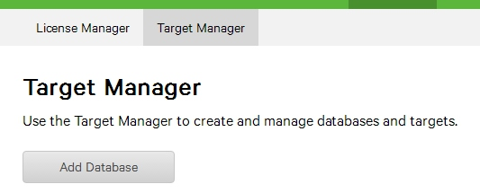
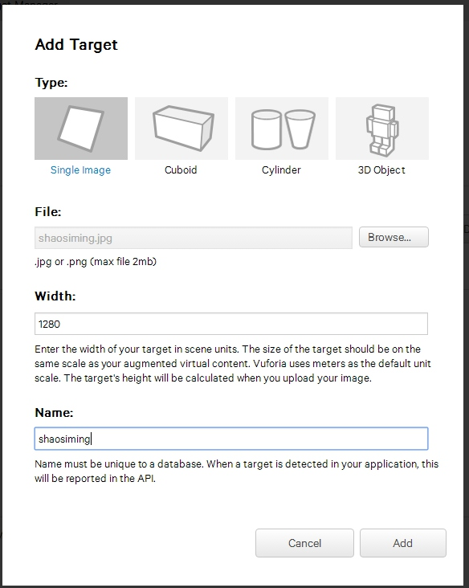

[TOC]
# 综述
最近学习了一部分感兴趣的AR技术，写几篇日志记录一下。

## AR技术简介
AR（Augmented Reality）是**一种实时计算摄影机影像的位置并加上相应图像的技术**。目前有两种通用定义：
- **虚拟物与现实结合、即时互动和三维**
- 现实-虚拟连续统（Milgram's Reality-Virtuality Continuum）
现今的AR应用大多运行在智能手机上，包括Pokemon（精灵宝可梦GO）等热门AR应用。但是，AR目前中的情况依旧处于起步阶段，没有出现大批的应用，通过其核心技术图像识别实现简单的增强现实效果。漫展上有看到过AR卡也是同样的原理。目前我看到的大多是用 Unity引擎配合AR SDK来进行开发应用。主流先说两款AR SDK（也可以叫平台）Vuforia和HiAR。HiAR在国内用的最多，包括看到的腾讯阿里百度华为等公司。
## Vuforia SDK开发环境
Vuforia这款开发平台是我入门的SDK的，这是平台的[官网](http://developer.vuforia.com)。接下来要做的就是搞定相关的开发环境。

步骤：
1. 进入官网注册帐号，右上角。需要邮箱确认。

 

2. 选择你需要下载的类型。目前的版本是vuforia-unity-6-2-10。最下面的Download Unity是下载对应的Unity补丁的。注意你的Unity版本不能低于SDK的使用标准。

 

3. 转换到Unity编辑器，我们新建一个工程（如果有了，可以导入SDK）.
 把这个.unitypackage包给拖入到你的unity工程的Project栏
 
全部导入，选择Import。

可能会出现下面这个API Update的要求，一般选择Go Ahead就行。
 
4. 导入需要一点时间，导入完成之后，能看到以下项目，说明我们的工作已经做好了。

 

## 实现Demo
接下去我们先做一个最简单的Demo。
步骤：
1. 视角切回Vuforia的官网，这个时候你已经注册完了。
在Develop栏下单击Get Development Key。

2. 填好你的app name和勾选框。再点击Confirm

3. 回到License Manager界面后，点击你新建的项目。就能看到我们所需要的Key。

4. 再接着，我们创建我们这个项目的数据库。

这个数据库的名字最好与你的应用名一样，方便后期的查找导出等工作。

5. 创建完毕之后点击进入数据库，添加你的识别目标。

因为只是一个demo，那么我们就先选择简单的image识别。选择图片（不能超过2MB），然后填写Width，Name（不能中文，不识别）

完成之后我们点击下载Datebase，这个星级代表这你的图片识别度。

这里选择Unity Editor。

6. 完成之后，我们点击下载这个.unitypackage包并导入。步骤上面已经有。
这是我们导入后的Project。

7. 接下来，我们就进入到了Unity编辑器的操作部分。在Vuforia -> Prefabs下有很多的预设体（unity的知识），把ARCamera和ImageTarget拖到Hierarchy视图中，并把场景创建时自带的Main Camera删除。这两个预设体：
- ARCamera：AR专用的摄像机和相关设置。
- ImageTarget：识别图像，带有识别事件的Component和其对应的C#脚本。（不做详细介绍）

点击ARCamera，选择Open Vuforia configuration（实际上就是Resources下的那个VuforiaConfiguration）

把我们之前复制的一大串的Key给复制进去。。很有可能忘了，赶紧回去去copy过来。

这个load datasets也要打勾

再轮到ImageTarget预设体，在箭头处设置对应的Database。

最后，你需要设置一个用来显示的三维模型。如果你身边没有资源（其实可以去商店找免费的资源，Unity娘就不错。），随手创建一个Cube或者Sphere就可以验证识别了。

## 检验效果
效果就暂时在电脑的摄像头上验证了，这个时候你点表情，出现的模型也会产生相应的变化。如果想把这部分打包成APK玩，就用unity打包就行。

## 后续
除了这样一张图片的转换，还有很多的基础的识别。比如AR卡，扫描之后能有舞蹈；一些互动的AR应用，后面学下去可能会补上。
