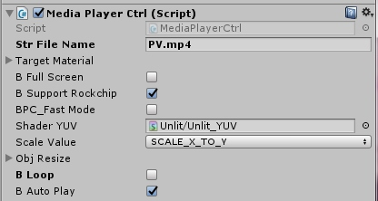
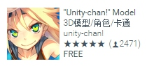
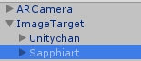
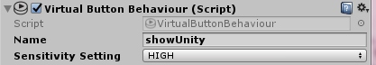
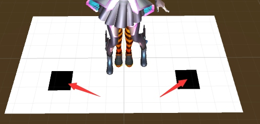
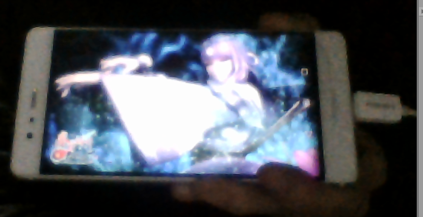
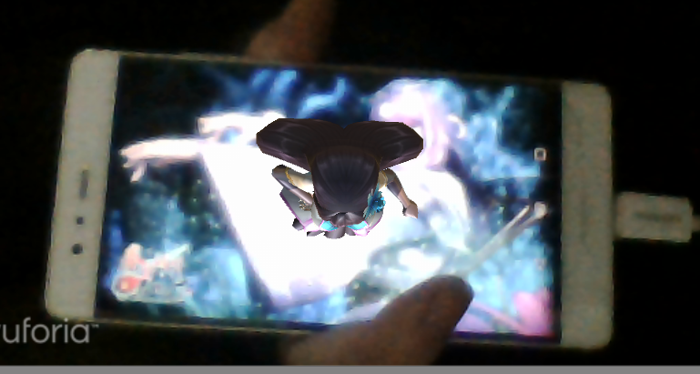
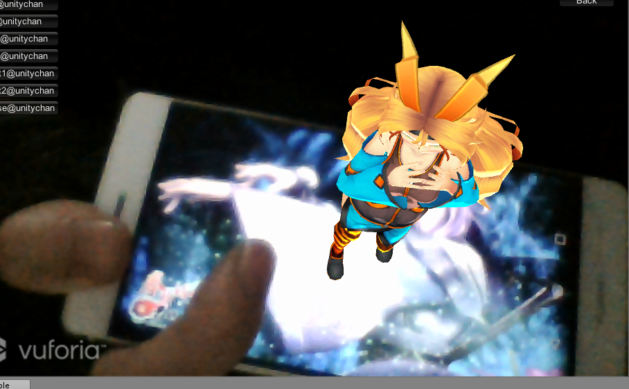

[TOC]
# （二）AR学习
前言：学了几天的AR开发，AR的底层实现，代码什么的还没有去研究。
## 动态加载模型
实际上就是把物体改成预制件Prefabs。简单的说，就是把物体从Hierarchy层级拖到Project层级，然后会发现H层级的物体文字变蓝色了，把他删了就行。然后我们为调用这个物体写一个C#脚本就行。这是一个优化的方案，识别的效果如果一次性加载的模型多，会有明显的感觉，在实际的AR项目中，这样可以减少手机内存的占用。
1. 我们找到DefaultTrackableEventHandler这个脚本，复制一份，然后修改。找到监听识别成功和监听识别丢失的方法进行修改。
```C#
private void OnTrackingFound()
        {
            Renderer[] rendererComponents = GetComponentsInChildren<Renderer>(true);
            Collider[] colliderComponents = GetComponentsInChildren<Collider>(true);

            // Enable rendering:
            foreach (Renderer component in rendererComponents)
            {
                component.enabled = true;
            }

            // Enable colliders:
            foreach (Collider component in colliderComponents)
            {
                component.enabled = true;
            }

            Debug.Log("Trackable " + mTrackableBehaviour.TrackableName + " found");
        }


        private void OnTrackingLost()
        {
            Renderer[] rendererComponents = GetComponentsInChildren<Renderer>(true);
            Collider[] colliderComponents = GetComponentsInChildren<Collider>(true);

            // Disable rendering:
            foreach (Renderer component in rendererComponents)
            {
                component.enabled = false;
            }

            // Disable colliders:
            foreach (Collider component in colliderComponents)
            {
                component.enabled = false;
            }

            Debug.Log("Trackable " + mTrackableBehaviour.TrackableName + " lost");
        }
```
这是写好的默认代码部分。核心就是调用GameObject.Instantiate和Destory，Resources.UnloadUnusedAsserts。
2. 修改后的代码如下：
```C#
// 识别成功
private void OnTrackingFound()
        {
            // 动态加载模型
            GameObject obj = GameObject.Instantiate(Resources.Load("xxx")) as GameObject;
            // 设置为识别物层级下
            obj.trasnform.parent = this.transform;
            // 位置
            obj.transform.position = this.transform.position;
        }
// 识别丢失
private void OnTrackingLost()
        {
           TrackObject toj = GetComponentInChildren<TrackObject>();
           if (toj != null)
           {
               Destroy(toj);
               Resources.UnloadUnusedAsserts();
           }
        }
```
## AR视频
AR视频就是扫描识别图，然后播放对应的视频。感觉这个也挺有意思的，偷偷摸摸传数据，一种间谍手段。。想多了。。
1. AR视频的方法有很多，我学了用EasyMovieTexture插件，这个插件是收费的。。。你也可以想办法免费搞到手。。。
2. 要做的方式差不多，这个插件的核心就是一个面片和一个Media组件。把这个导入的EasyMovieTexture中的预制件VideoMananger拖入到ImageTarget层级下，然后设置对应的播放的视频。Unity支持的视频格式很多，mp4、avi，mov和mpg都可以。


3. 不过要注意把视频拉到这个StreamingAsserts的文件夹下，不然播放不了。


还有，这个识别不能在PC端进行，你需要打包成apk在真机上运行，运行效果就不展示了。
## 虚拟按键
虚拟按键听上去比较酷，是比较基础的与虚拟模型交互的方式之一。我们可以以此为基准扩展更多的模型行为，比如跳舞，切换场景，人物摔倒等等。Vuforia SDK为我们提供了方便的Virtual Button来实现虚拟按键的功能。我们按照以下步骤完成虚拟按键的设置：
1. 下载Vuforia SDK，完成工具包的导入和License Key的添加。这在之前的学习Demo时已经比较熟悉，不过还是有一点的繁琐。
2. 创建Unity工程并导入SDK包。
3. 删除Scene自带的Main Camara，换上SDK的ARCamera，ImageTarget也拖入到场景中。（不要忘了填App License Key，没填可运行不起来。）
4. 那么开始不同于之前的部分。首先要考虑按键触发什么事件，我就随便一点了：按一个键显示一个人物，抬起隐藏。人物Mod的话继续从Assert Store里面找free only的。。

就这两个吧。
5. 把这两个人物给拖到ImageTarget层级下。


再从Prefabs预制件找到虚拟按键VirtualButton，拖到ImageTarget层级下。并在Virtual Button BehaviourC#脚本组建下设置按钮的名字。


这里的Sensitivity反应敏感度我设置为high，一般来说是越灵敏越好。


看Scene视图中，这两个黑黑（颜色贴图什么的可以改）的就是按钮。
6. 接下来要写最关键的C#脚本部分。
```C#
using System.Collections;
using System.Collections.Generic;
using UnityEngine;
using Vuforia;

public class ChangeModol : MonoBehaviour,IVirtualButtonEventHandler {

	// 两位人物
	private GameObject Unitychan;
	private GameObject Sapphiart;

	//  按钮按下的情况
	public void OnButtonPressed(VirtualButtonAbstractBehaviour vb)
	{
		Debug.Log ("按钮被按下了！！！！");
		switch (vb.VirtualButtonName) 
		{
		case "showUnity":
			Unitychan.SetActive(true);
			break;
		case "showSapphy":
			Sapphiart.SetActive(true);
			break;
		}
	}

	// 按钮松开的情况
	public void OnButtonReleased(VirtualButtonAbstractBehaviour vb)
	{
		Debug.Log ("按钮被松开了！！！！");
		switch (vb.VirtualButtonName) 
		{
		case "showUnity":
			Unitychan.SetActive(false);
			break;
		case "showSapphy":
			Sapphiart.SetActive(false);
			break;
		}
	}

	// 初始化
	void Start () 
	{
	   // 在物体类中找到带VirtualButtonBehaviour组件的
		VirtualButtonBehaviour[] vbs = GetComponentsInChildren<VirtualButtonBehaviour> ();	
		// 注册对应数量的事件
		for (int num = 0; num < vbs.Length; ++num) 
		{
			// 在虚拟按钮中注册TrackableBehaviour事件
			vbs[num].RegisterEventHandler (this);
		}

		// 得到对应的物体
		Unitychan = transform.Find ("Unitychan").gameObject;
		Sapphiart = transform.Find ("Sapphiart").gameObject;

		// 初始进入时隐藏双人物
		Unitychan.SetActive(false);
		Sapphiart.SetActive (false);
	}
	
	// 更新
	void Update () 
	{
		
	}
		
}
```
这份代码，最关键的就是继承的IVirtualButtonEventHandler，很明显，这里面封装了OnButtonPressend和OnButtonReleased两个方法。那就思路清楚了，我们注册这个按钮事件，然后找到两个人物物体，进行显示和隐藏。其余的代码部分应该能看懂。
7. 实现效果
一开始人物都是隐藏的。


 
按住一个按钮，出现一个人物，松开后隐藏这个按钮对应的人物。




如果同时按住这两个按钮，就会出现两个人物，不演示了。（实际上是截图有点麻烦。。。）