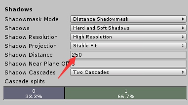
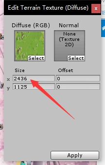

# Unity学习记录
- 一般的移动都可以用transform.Rotate(x,y,z)来移动，这个函数在update里面调用。但是有一点是Character由自带的Move函数可以使用。（最好是用这个，但也可以用前者。）
- 移动速度，有一个可以避免平台的不同导致的速度不同的方法，就是使用间隔的时间去移动,update是跟帧有关的，那么有些是固定30帧，固定60帧。所以可以有如下的代码，根据计算机的快慢缩放速度来运动：
```C#
void update()
{
    float deltaX = Input.GetAxis("Horizontal") * speed;
    float deltaZ = Input.GetAxis("Vertical") * speed;
    transform.Translate(deltaX * Time.deltaTime,0,deltaZ * Time.deltaTime);
}
```
- Unity的语法中经常使用委托的Event方法，会用到OnEnable和OnDisable。这两个函数实在物体的生命周期的OnEnable时被调用的，与Awake被调用的时间差不多，我们在这两个函数里面布置相应的委托和方法。
- 物体中的position如果在场景中有父节点，那么当前的position时local的，但是transform.position永远是世界坐标系，如果有特殊的需求，可以用相关的API进行转换。
- 摄像机的转换，可以直接设置其SetActive，不过不能在update里面设置，估计也不能在FixUpdate里面进行，因为执行次数不一致。
- 去焦点跟主程聊的时候为什么不用Lua实现cocos的客户端，因为端游自身有热更新，Lua最大的优点，而C++本身的性能高，只要有能力避免，就能成功。
- SetSiblingIndex可以修改当前UI的遮挡关系。其中SetSiblingIndex(0)是最大的。需要提前知道Unity的遮挡是绘制的关系，先绘制的在前面。
- 为什么现在都不强调语言的性能了，是因为现在的硬件设备跟上来了，所以响应时间，运算时间被大大的缩短了，所以我们现在能看到的语言执行速度，比C/C++慢了。
- 看到有一行代码，始终不理解他的原理，是  public bool bIsButtonDown = Input.GetButton("Fire1")这个虚拟按键我始终找不到在哪里，后来我换了一种思路，这个虚拟按键不是普通的按键，我把这个脚本放置到一个物体上时，这个物体就变成了虚拟按键，所以这行代码可以简单用来代表物体按钮。
- unity里面的默认阴影显现距离是很短的，大概是20。如果你要在远处也能实时渲染阴影，是增大消耗的，我们可以在Edit->Project settings->Quality->Shadows处调整。



- 近几天被角度搞的一团浆糊，需要以下几个技能，就是能指向当前的Scene的视角。能够随意的切换物体到一个视角，即为GameObject.transfor.Lookat（），也可以是rotateAround绕一个轴，点，物体旋转。这个LookAt很关键。
- GetComponent和GameObject.Find，Debug.Log的使用很消耗性能。
- Unity的渲染有四套绘制，但是后面能在Game，也就是打包的游戏中真正看到的是只有2套，而且GL调用OpenGL接口，C#语言底层化。
- Unity的重力是默认-9.81的，但是在游戏中实际感受会有偏差，所以我调高了这个数值，看起来效果更佳的好。
- Unity里面的同步位置，我认为罗培羽老师的书里面写的很不错，提到了瞬移式同步，移动式同步，预测式同步。前面两者分别有瞬移和误差大的问题。而第三者解决的比较好。这本书里面的位置预测算法由客户端完成，服务端负责校验和转发。
- 之前有一个我很著名的错误，就是所有游戏，都进行在同一个场景中。有些独立游戏是这样，没错。但是给了我另一种思路，就是说读取界面放在一个scene里面，然后异步读取，不然会有在界面的操作，渗透到游戏交互界面。
- 48小时，72小时的游戏独立开发，非常考验个人综合素质，所以看到一款游戏，就要去想一想如何去实现。
- 这次主要是体验到了Unity物理引擎的实现，以及物理的机制。（特别需要一个大量的游戏阅历，所以我需要玩PS4，要充分利用这个主机。然后下Steam的游戏，然后是独立游戏，Taptap）
- 理解GetKeyUp，GetKey和GetKeyDown三者的区别。Up是抬起来的那一刻，Down是按下去的那一帧，然后立刻进入GetKey这一步中。
- 又进入了unity的粒子领域，粒子领域最明显的一点就是参数的众多，比cocos的优点之一就是说可以单个的调控，而且属于立即调立即看的那种。使用到粒子的大小区域，以前时无法通过操纵scale来扩大的，现在可以修改scale mode使用Hire面板属性来扩大。（切记不要在其他模式下用scale修改，而且粒子无法修改位置）粒子时用碰撞的，不仅仅时粒子之间的碰撞，还有与物体之间的碰撞。OnParticleCollision函数里进行处理，记得在外面的面板打开OnCollider。
- 接触到了弹性，软性方面的需求。
- DontDestroyOnLoad的作用是什么，可能会有各种情况，单例类会被销毁，这样就会造成相应的很多的麻烦，所以我们需要对这些音效模块，等等在Awake的时候设置为禁止销毁。
- unity的地形相关问题，就是贴图的问题。如果想使用一张贴图作为地板，很有可能会有Repeat很多小型的，看起来很鬼畜难看，这个时候把贴图的密度调一下即可，调节密度的位置在贴图的Size处。

- AddForce是加一般的里，AddTorque可以加旋转的力
- Unity的触发事件有一个Event Trigger，可以有几乎你可以想到的额外触发事件。非常的棒，可以把例如Slider本身并不绑定的Point Cliclk事件给添加进去。
- 说一下协程的内容StartCoroutine和yield return，这两个一个是开启协程，一个是返回的时间。StartCoroutine就是开启一个协程，yield return 是迭代器块返回调用迭代的地方。
- StartCoroutine中嵌套一个yield return StartCoroutine,第一个StartCoroutine会等到第二个StartCoroutine中所有代码结束后再继续执行，而第二个StartCoroutine中的yield语句会先返回第一个，然后立即返回他的调用处，也就是调用处会继续执行，而第一个StartCoroutine会等待第二个执行完再继续执行。StartCoroutine（XXX），主要的延时时间函数是new WaitForSenconds(int num)记得加上new。yield return null（暂停协程，等待下一帧继续执行。这个null要单独记忆）就是说等待x帧后继续执行，而update继续执行。x帧后继续执行IEnumerator。（白话就是说你先走吧，我等X秒后再走，我先休息一下）
- 游戏引擎中的多线程，单线程问题。大多数游戏引擎都是单线程的，因为有一个帧的概念，帧是有严格顺序的，不能出现不确定性，也就是说游戏中画面更新和逻辑更新的时间点必须有确定性，必须严格按照顺序列进行同步。强行使用多线程会增大编程难度。Unity中的异步加载资源，异步加载场景，使用的都是协程，我理解为伪多线程。协程也是在主线程中调用的，不算线程。
- Unity中使用的第一个主线程是网络通信的时候，就是客户端和服务端进行Socket通信，使用BeginReceive进行异步接收信息，在System.Net.Sockets中定义，不用自己手动开启线程，使用封装好的C#线程池实现。
- Unity可以使用多线程的地方：1.网络通信2.需要处理复杂算法的计算3.复杂的秘籍的I/O操作4.Unity的NativePlugin
- Unity有一个框架的代码兼容的问题，需要提升.NETFramework的版本，这个在打开的.sln文件里面是无法定义的，因为属性页打不开，即使打开了也没有用。需要在File->Build & Setting->PlayerSetting->OtherSetting里面进行调整，会自动追踪到当前的.NETFramework的版本。
- 今天unity炸数值了，数值把unity编辑器直接给崩溃了。因为发射的位置信息没有进行归一化，也就是说这个值非常大，大到超出了float的范围，就直接炸了。也没有错误提示。
- 现在这个项目游戏主场景中有四个摄像机，第一次击球时有4个摄像机，3个重要摄像机和1个小地图摄像机，这四个全部处于打开状态。
- DestroyImediately是真的把Aessert在文件夹中删除，Destroy只是摧毁而已，游戏中的物体概念。
- 在上传Git或者版本控制时，只需要传2个文件即可。一个是Assert，还有一个是ProjectSetting