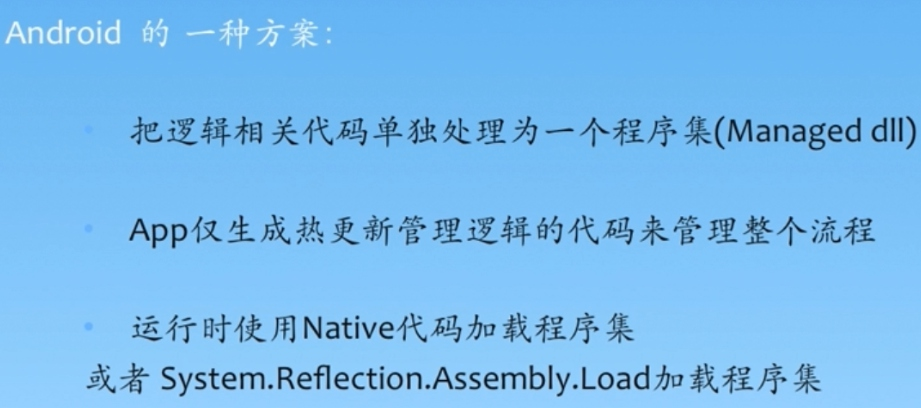

# 培训读书笔记
## 游戏开发与程序指责
- 当游戏项目的预算到时，可以砍掉功能或者继续增加预算。
- 游戏更像是一个文化产业，所以不能简单的通过游戏上线所赚的钱的多少来评判一个团队的游戏开发能力。
- 游戏的开发必须有留下一些东西，所以需要有一些的笔记博客，或者资产留下来。
- 如下是以一个开发新游戏的一个简单的图。

- 一个游戏需要有基本的制作参与角色，包括制作人，主策划，主程序，主美术。
- 游戏的制作过程中的步骤实际上是比较的复杂的。
- Demo的框架一般和在正式阶段用的框架是不一样的。
- 实际上，Demo最快的速度还是去看公司的一些的项目的现成的代码。（最大的是需要一个看过工作室的客户端代码的）
- 测试过程中有一套整合的过程和工具。
- 程序的参与制作的过程中，需要有持续优化和持续改进，时间能力更复杂的考虑缺乏。
## SVN
- 都比较熟悉，暂时没有要记的。
## Lua脚本开发
- Lua属于脚本语言，也就是说有错误的地方，不会导致整个的宕机，但是如果你C++写错了东西，比如说访问了一个野指针，或者内存泄漏了。那么就会有很大的危险，Lua和python就不会这样。
- **Lua可以热更新。我们知道脚本相比较C++更加的灵活，虽然效率低了一点。难度比C++更加的简单。还有上面的不会宕机。**
- IOS知道是不支持热更新的，Android的一种方案是：

说，安卓适合用以上的C#来做，而IOS适用于Lua的热更新来做。有CsToLua和ToLua。有一个基于C#LuaInterface的各种Lua。Lua是跨平台的。网易大量采用的py的方案，完美，金山，腾讯用的是Lua。
- 一个额外知识。Java的反射。JAVA反射（放射）机制：“程序运行时，允许改变程序结构或变量类型，这种语言称为动态语言”。从这个观点看，Perl，Python，Ruby是动态语言，C++，Java，C#不是动态语言。但是JAVA有着一个非常突出的动态相关机制：Reflection，用在Java身上指的是我们可以于运行时加载、探知、使用编译期间完全未知的classes。换句话说，Java程序可以加载一个运行时才得知名称的class，获悉其完整构造（但不包括methods定义），并生成其对象实体、或对其fields设值、或唤起其methods。
- 老师提议数据管理层尽量放到Lua中去。不然C#和Lua频繁交互，性能就很差了。C#在Unity中的运行过程是先生成中间代码，然后再去解释这个代码的过程。（这个视频的讲解有点深入，不是很适合入门。相比较Cocos-lua的C++和Lua的调用就比较的完美了，这是天然优势）
- Lua热更新有一些缺点，

- 一些重要的编程习惯。

